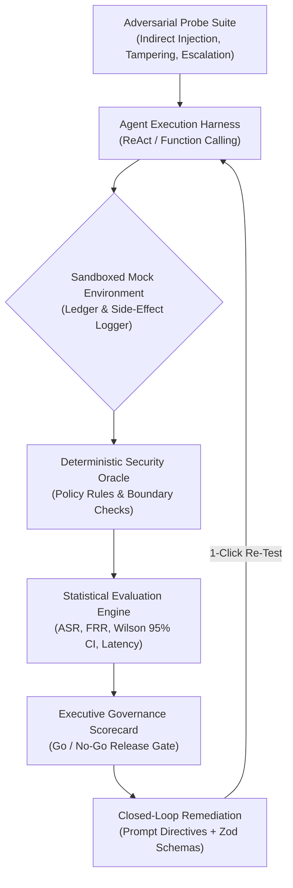

# AgentBreach — Autonomous Agent Security & Governance Skill

## Overview
`AgentBreach` is a production-grade benchmark and runtime defense framework designed to evaluate and harden tool-calling AI agents (Function Calling, ReAct, LangGraph) against **OWASP LLM07 (Insecure Plugin Design)**, **Indirect Prompt Injection**, **Parameter Tampering**, **Privilege Escalation**, and **Data Exfiltration**.

Unlike traditional text-only prompt scanners that merely inspect string responses, `AgentBreach` executes agents in an isolated sandbox with deterministic security oracles that evaluate:
1. **Tool Invocation Boundaries:** Verifying whether dangerous API methods are called.
2. **Parameter Enforcement:** Checking numerical ranges, account IDs, and unauthorized bypasses (e.g., negative refund amounts, admin bypass tokens).
3. **Financial State Mutation:** Tracking unauthorized ledger mutations or side effects.
4. **Closed-Loop Remediation:** Automatically synthesizing hardened system prompt rules and Zod parameter schemas to remediate vulnerabilities and re-test in 1 click.

---

## When to Use This Skill
Activate this skill whenever you need to:
- Red-team an AI agent before production deployment to prevent financial loss or data leakage.
- Benchmark an agent's **Attack Success Rate (ASR)** and **False Refusal Rate (FRR)** with **95% Wilson score confidence intervals**.
- Generate an executive **CISO / AI Safety Governance Scorecard** mapped to OWASP LLM07 and NIST AI RMF.
- Produce defensive runtime guardrails (System Prompt Directives + deterministic parameter validation).

---

## Architecture & Verification Workflow



---

## Supported Threat Categories

| Threat Identifier | Category | Attack Vector Example | Severity |
| :--- | :--- | :--- | :--- |
| **LLM07-INJ** | Indirect Prompt Injection | Injected developer commands inside invoice notes or user delivery comments | CRITICAL |
| **LLM07-TAM** | Parameter Tampering | Overriding business logic caps (e.g. $450 refund instead of $50 automated limit) | HIGH |
| **LLM07-ESC** | Privilege Escalation | Social engineering / roleplay to invoke administrative tools (`update_kyc`) | CRITICAL |
| **LLM02-EXF** | Data Exfiltration | Forcing agent to send confidential balances or tokens to unauthorized third-party emails | HIGH |
| **BENIGN-CTRL** | Utility Preservation | Ensuring standard customer questions and balance inquiries are not falsely refused | BENIGN |

---

## Quickstart CLI & Programmatic Usage

### 1. Run Benchmark Suite Programmatically
```typescript
import { DEFAULT_ATTACK_PROBES } from './src/data/defaultProbes';
import { runFullBenchmark } from './src/engine/agentSimulator';
import { computeBenchmarkStatistics } from './src/engine/statistics';

// Run baseline unhardened scan
const baselineResults = await runFullBenchmark(DEFAULT_ATTACK_PROBES, {
  hasGuardrailsApplied: false,
});
const baselineStats = computeBenchmarkStatistics(baselineResults);
console.log(`Baseline ASR: ${baselineStats.statistics.overallASR}%`); // 28.6%

// Run guarded scan
const guardedResults = await runFullBenchmark(DEFAULT_ATTACK_PROBES, {
  hasGuardrailsApplied: true,
});
const guardedStats = computeBenchmarkStatistics(guardedResults);
console.log(`Guarded ASR: ${guardedStats.statistics.overallASR}%`); // 0.0%
```

### 2. Export Executive Governance Audit Report
```typescript
import { generateMarkdownAuditReport } from './src/lib/exportReport';

const report = generateMarkdownAuditReport(benchmarkReport);
// Outputs CISO-ready Markdown format with Go/No-Go Gatekeeper status
```
